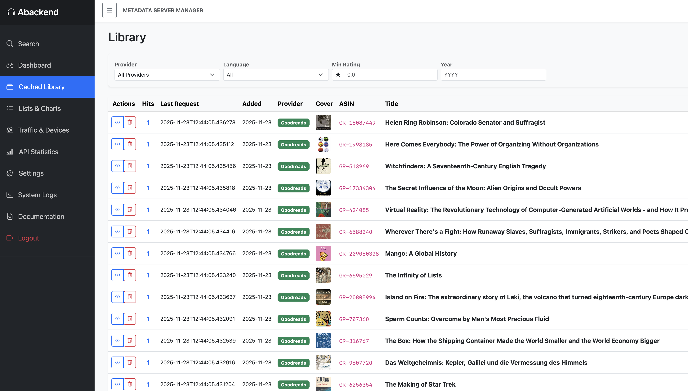
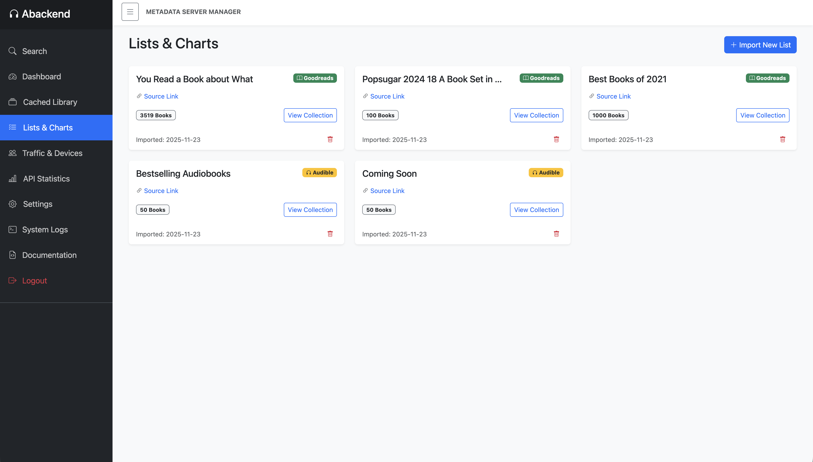
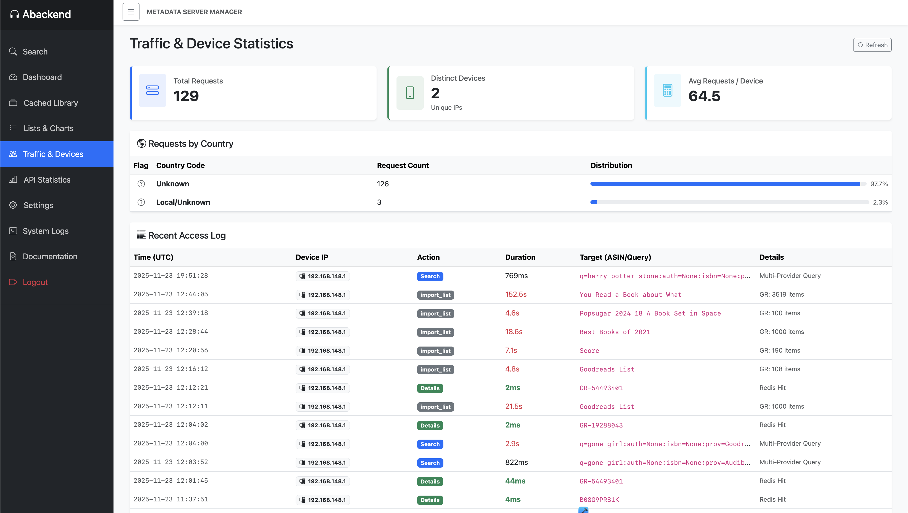
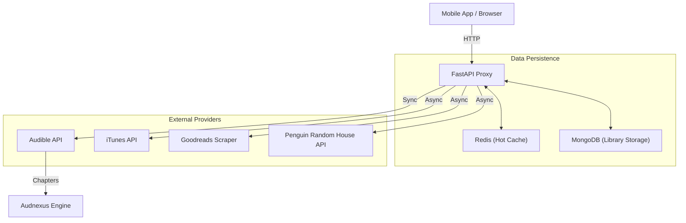

# 🎧 Abackend Audiobook Metadata Proxy

A high-performance, self-hosted **metadata aggregator API** and **dashboard** for audiobook collectors and developers.

This server sits between your mobile app/media server and external data sources. It aggregates, normalizes, and caches metadata from **Audible, iTunes, Goodreads, and Penguin Random House** into a single, unified JSON format.



## ✨ Features

*   **Multi-Provider Search:** Parallel querying of Audible, iTunes, Goodreads, and PRH with results merging.
*   **Smart Caching:**
    *   **Redis:** Hot cache for millisecond-response times.
    *   **MongoDB:** Persistent library storage (scales to 100k+ books).
*   **Rich Metadata:** Fetches high-res covers, authors, narrators, ratings, runtime, and **chapter timings**.
*   **List Importer:** Scrape and import entire lists from **Goodreads** (e.g., "Best Sci-Fi") or **Audible** (Charts, Series) with one click.
*   **Management Dashboard:**
    *   **Library:** View, filter, and manage your cached collection.
    *   **Stats:** Real-time traffic analysis, device tracking, and API benchmarking.
    *   **Settings:** Toggle providers and configure search limits on the fly.
    *   **Logs:** Live system logs viewer.
*   **Authentication:** Secure JWT-based authentication for API and Dashboard access.

## 📸 Interface

<p align="center">
  
  
</p>

---

## 🚀 Getting Started

### Prerequisites
*   **Docker** & **Docker Compose**
*   **Python 3.11+** (only required locally to generate Audible auth file)

### 1. Clone the Repository
```bash
git clone https://github.com/yourusername/audio-metadata-proxy.git
cd audio-metadata-proxy
```

### 2. Generate Audible Credentials (Important)
To fetch accurate chapter timings and perform advanced searches, the server acts as a registered Audible device.

1.  Install the audible-cli locally:
    ```bash
    pip install audible-cli
    ```
2.  Run the quickstart wizard (Follow the prompts to log in to Amazon):
    ```bash
    audible-quickstart
    ```
3.  Locate the generated file (usually named `audible_cmd.json` or `audible_auth.json`).
4.  **Rename it** to `audible_auth.json` and **move it** into the `proxy_service/` folder of this project.

### 3. Environment Configuration
Create a `.env` file in the root directory (or use the defaults in `docker-compose.yml` for development).

```ini
# Optional Overrides
MONGO_URL=mongodb://mongo_db:27017
REDIS_URL=redis://redis_cache:6379
PRH_API_KEY=your_key_here  # Optional: For Penguin Random House support
SECRET_KEY=super_secret_string_change_me
ADMIN_USERNAME=admin
# ADMIN_PASSWORD_HASH=... (Optional: Generated automatically on startup if missing)
```

### 4. Run with Docker
```bash
docker-compose up -d --build
```

Once running, access the dashboard at: **http://localhost:8000/dashboard**
*   **Default User:** `admin`
*   **Default Password:** `admin`

---

## 📚 Dashboard & UI

*   **Dashboard:** Overview of top requested books and recent activity.
*   **Library:** A spreadsheet-style view of all cached books. Supports filtering by Rating, Language, Provider, and Year.
*   **Lists:** Import public URLs from Goodreads or Audible to bulk-populate your library.
*   **Traffic:** View distinct devices (IPs), geolocation (Countries), and response time latency.
*   **Settings:** Enable/Disable specific providers (e.g., turn off iTunes if you don't want it) and wipe the cache.

---

## 🔌 API Reference

The API is protected. You must include the `Authorization: Bearer <token>` header or be logged into the dashboard (Cookie).

### 1. Search
Search across all active providers.
```http
GET /search?q=The+Martian&author=Andy+Weir&min_rating=4.5
```

### 2. Get Details
Fetch consolidated metadata for a specific ID.
```http
GET /book/{asin}
```
*Supports Audible ASINs (`B0...`), iTunes IDs (`123...`), and PRH ISBNs (`978...`).*

### 3. Import List
Trigger a background job to scrape and import a list.
```http
POST /lists/import
Content-Type: application/json

{
  "url": "https://www.goodreads.com/list/show/1938.Best_Books_Ever"
}
```

*Full documentation is available in the dashboard under the **Documentation** tab or at `/docs` (Swagger UI).*

---

## 🛠 Architecture



## 📦 Data Providers

| Provider | Status | Best For | Notes |
| :--- | :--- | :--- | :--- |
| **Audible** | 🟢 Active | **Chapters**, Narrators, Series | Requires `audible_auth.json` |
| **iTunes** | 🟢 Active | High-Res Covers, Release Dates | Public API, no auth needed |
| **Goodreads** | 🟢 Active | User Ratings, Genres, Lists | Web scraping (Rate limited) |
| **PRH** | 🟢 Active | Official Descriptions, ISBNs | Requires API Key |

## 🤝 Contributing

1.  Fork the repository.
2.  Create a feature branch (`git checkout -b feature/NewProvider`).
3.  Commit your changes.
4.  Push to the branch and open a Pull Request.

## 📄 License

Distributed under the MIT License. See `LICENSE` for more information.
